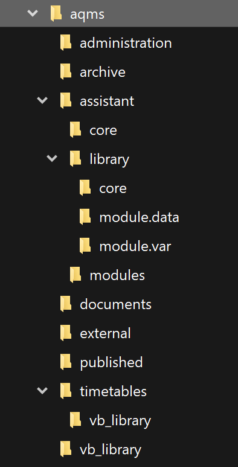
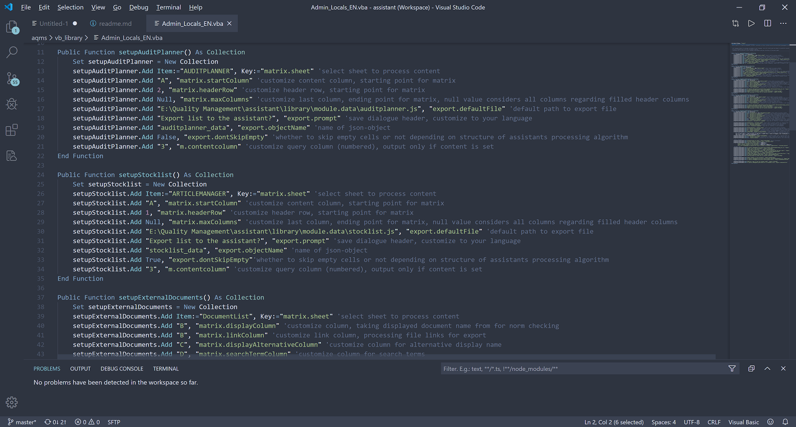
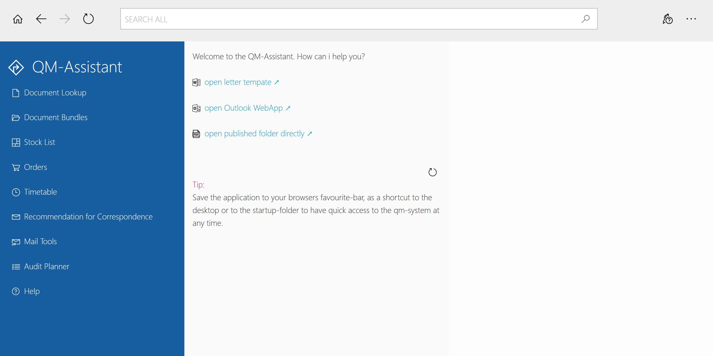
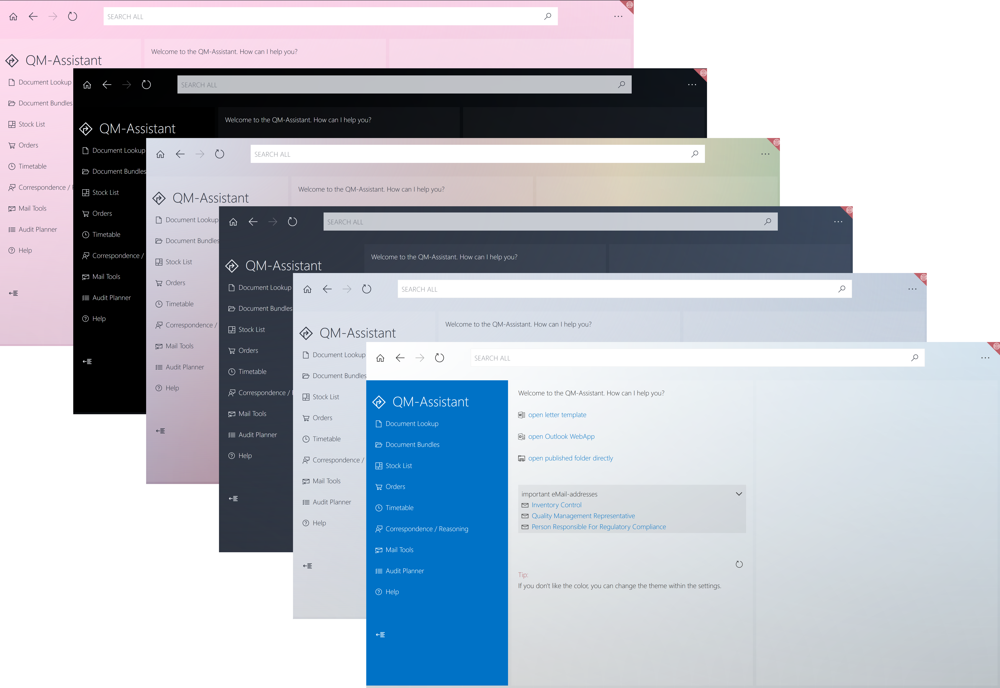
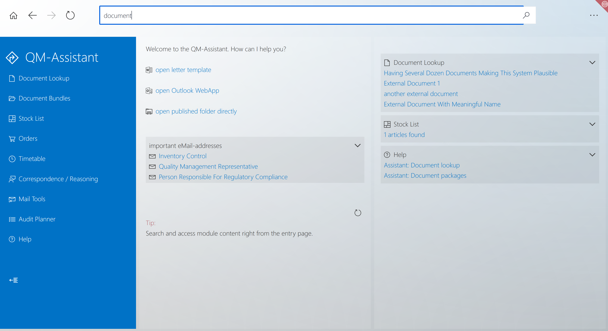
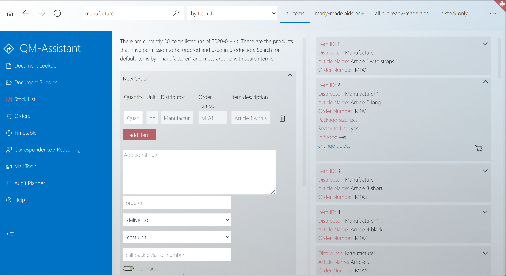

# bottle light quality management software

```
      m
	 / \    automate your paper based qms with
	|...|
	|...|   bottle light quality management software
	|___|	by error on line 1 (erroronline.one)
	/ | \
```

[](https://github.com/erroronline1/qualitymanagement/commits/master)


[](http://erroronline.one/column3/aqms/assistant/QM-Assistant.html)

compatible with


## table of contents

* [use case](#use-case)
* [about bottle light qms](#about-bottle-light-qms)
* [the core documents](#the-core-documents)
	* [use case](#use-case-1)
	* [what the documents do](#what-the-documents-do)
	* [requirements](#requirements)
* [the assistant](#the-assistant)
	* [use case](#use-case-2)
	* [what this tool does](#what-this-tool-does)
	* [requirements](#requirements-1)
* [installation](#installation)
* [but i am no programmer!](#but-i-am-no-programmer)
* [details](#details)
	* [the documents](#the-documents)
	* [impressions](#overview-of-documents-in-force-and-assertion-of-checkpoints)
	* [the assistant](#the-assistant-1)
	* [impressions](#comes-with-different-themes)
	* [features / provided modules](#provided-modules-within-open-source-distribution)
	* [thoughts and considerations](#thoughts-and-considerations)
	* [changes and updates](#changes-and-updates)
* [disclaimer](#disclaimer)
* [license](#license)

## use case
while it makes way more sense to automate quality management using assistive technology and digitalizing everything, this is not always possible. therefore this quality management software has a very specific use case depending on your environment:

* your quality managment and documentation is still mainly paper-based
* employees have access to the it-infrastructure and printers, e.g. via network and group-accounts
* your company relies on microsoft office
* there is at least one tech-savvy employee interested in getting things done

[by error on line 1](http://erroronline.one) but feel free to use and modify at your own risk according to the license outlined below. i am happy to get feedback on code- and documentation-quality since this is my first official open source project.

this quality management software has been in use in context to [iso 13485:2015](https://www.iso.org/search.html?q=13485%3A2016) and was approved by the certification authority.

[back to top](#a-quality-management-software)

# about bottle light qms
if your company does not have the ressources to test out different expensive qm-software-solutions until you find one to suit your needs and you somehow make use of the simple tools you have access to, bottle light qms might be a good start for you.
by using quite basic ressources like microsoft office word and excel and standard browsers it also is able to bypass weird system restrictions. editing (if necessary) can be done via any given text editor.
still this system support you with version control, archiving and publishing quality related documents and ressources.

```
      m
	 / \    
	|...|
	|...|   bottle light quality management software
	|___|	by error on line 1 (erroronline.one)
	/ | \
```
the name is inspired by [alfredo mosers bottle lights](https://www.bbc.com/news/magazine-23536914) that have an extraordinary effect by combining ressources that have nothing in common in the first place. while bottle lights still make no electric light bulb they serve their purpose better than expected, illuminating thousands of homes with materials that presumably have nothing to do with illumination in the first place.

while not expecting to influence as many lives as the real bottle light i do hope this software does a better job at supporting quality management as you would usually expect from word-, excel- and javascript-files.

and yes, whether or not i should use ascii to do a logo, i most certainly can.

# the core documents
## use case
the office documents come with built-in vba-code to handle document version control, its overview and export-handling. employees use mainly unchangeable pdf-files to fill out during workflow. each document registers and manages itself (kind of).

## what the documents do
style the blueprints according to your desired corporate design whatever you like and however word allows you to. just make sure you don't delete the in-built fields.
customize the variables within the vba-code.

in general this system
* supports your version control
* supports you being backed up at any time
* makes sure you took every aspect into account regarding the norm - but you can modify checkpoints to your needs
* makes sure everyone has access to documents and functions you decide to is supposed to - in case your quality manager calls in sick there is still access to the system (as supposed to a software i saw whose document access was fully dependent on profile login and license number)
* supports free word design choices (as supposed to the aforementioned softwares styling limitations due to use of .rtf-templates)
* has a built in interface for general availability of information - data export to the assistant

## requirements
* one somewhat experienced office user to customize the document-blueprints and vba-codes
* microsoft office 2010+ (tested with office 2010, 2016 and 2019 professional, word and excel)

[back to top](#a-quality-management-software)

# the assistant
## use case
this tool serves as an assistive layer to access your companies documents in form of a web-app with read-only-properties.

## what this tool does
this tool provides your company with an application to have an easier access to your quality management system. if you provide your employees with access via this assistant it might be way more easy to have them use only the latest documentation version. it does access files that could be reached by file-explorer as well, but avoiding the latter way prevents the employees to make copies that may become obsolete, at least to some degree.

* global access to qm-related ressources for every employee
* easy lookup methods for finding documents, materials and orders regardless of storage path or restricted erp-access, in case alternative search term are provided it is even more easy to find these
* easy content updates directly from the provided vba-interfaces
* compatible to ms ie11 because it was built for it, tested successfully with firefox, chrome and edge as well
* easily extendable with modules for various custom data automation

## requirements
* one webdeveloper to customize the application for your companies needs and provide you with desired additional modules
* network access for every employee to access the assistant only from one source
* serial print of document packages requires active-x which is only available in ie11. this option will not be shown if not accessible
* patience with coworkers blaming 'your' assistant for every network failure, printer settings and their inability to read the literal hints and descriptions

[](http://erroronline.one/column3/aqms/assistant/QM-Assistant.html)


[back to top](#a-quality-management-software)

# installation
there is no installation routine. place the files to your desired accessible network-folders and customize them by hand. create or recreate your documents with the provided template_file.docm and let the workflow guide you through the registration.


* the provided folder structure might not be neccessarily your first choice and serves just as a sample. you have to change at least the default paths within the vba-code and the assistant anyway.
* even if you don't want to use the assistant, the documents semiautomated version control still might be useful for you. on the other hand the assistant is hardly possible to populate without the documents unless you write your own routines for that.
* i'd recommend an educated access-management. it may be a good idea to store docm-templates in a folder with restricted access to qm-managers, deputies and ceo, while access to pdfs, timetables and the assistant application should be granted for everyone.

[back to top](#a-quality-management-software)

# bUt I aM nO pRoGrAmMeR!
to customize this software to your needs it is definitely neccessary to have someone change values within the vba-code- and the javascript-configuration files. you might at least know someone who does this as a hobby and is happy to do that for you for a couple of drinks. or after these...
i was hoping to have done enough documentation and commenting, so maybe you might as well get a grasp on changing the setting-files yourself. 
**on the bright side everything is open source and can be maintained by any programmer/webdeveloper/webdeveloping agency that does javascript and knows how to access the visual basic editor via the office developer tab!**

[back to top](#a-quality-management-software)

# details
## the documents
the vba-code can be customized quite easily for i tried to have all important parts split to functions and modules to be able to enable/disable these on demand as well as using variables to customize easily. in the best case all you have to do is to change the variables within the locals-modules. office-documents contain basically just functions to import outsourced modules and event handler. set up language and location of modules and you are almost ready to go. 

* customize the variables for prompts to your language
* you can provide default paths within the code - but paths will always be selectable
* you can change rows and columns within the local-setup of tables in case you want to provide different information on save of office-files
* you will be guided through version control and can choose whether to auto-update version and release date or set these manually
* archiving files with latest version number
* exporting files to unchangeable pdf (you might want to overhaul them to editable forms, but that requires additional software)
* updating the list of current documents in force
* central code modules makes changes to desired behaviour more easily

on save of excel-lists
* there will be an automated check if you have your documents fitting to all queried aspects
* you will be asked if you want to export/update the files list for the assistant application

*be aware that word 2019 has a different format output of doc- and pdf-files. this may lead to differing page-numbers registered to the list of documents in force and actual page-numbers in the accessible pdf-files.*

### why excel though?
it's widely agreed upon that excel does not serve as a sufficient database. on the other hand most people are experienced with excel to the degree where they do not have angst starting the application. it is available on most business setups and definetly more easy to handle and customize than access. if your datasets of documents in charge exceed excels capabilities your qm-system got out of hand anyway. if your stocklist exceeds excels capabilities you did not bothering reading to this point anyway because of using a more sufficient software for this. or it got out of hand as well. in this case you probably should tidy up.

explanatory readme-files:
* [administrative lists and document blueprint](administration/readme.md)
* [timetable blueprints](timetables/readme.md)
* [vba modules](vb-library/readme.md)

[back to top](#a-quality-management-software)

### overview of documents in force and assertion of checkpoints


docm-files as working draft will register and update their version in this table. assign checkpoints to have a regulatory context. this list serves as the interface for the documents module for the assistant too. export will be executed on save.

### overview of matched checkpoints


this list should contain all relevant considerable chapters. on save documents will be assigned back to the list to clarify if every chapter is met.

### overview of document bundles


assign documents to regulary common used bundles. this also serves as the interface for the assistants bundles module. export will be executed on save.

### overview of external documents in force


this list serves as an overview of acknowledged external documents in use as well as the interface for the assistants document module on save.

### audit planner


this sort of database contains questionsets for internal audits regarding all relevant topics. on save an export for the assistants module will be executed.

### customize the vba-variables within the locals modules in the vb-library folders


hopefully all relevant variables can be set here to customize the code to optional rearrangements of the different tables layout.

### timetables


timetracking with excel as an addon. not quite related to quality management in the first place but can come in handy and is implemented in the general process surface of the assistant as well.

[back to top](#a-quality-management-software)

## the assistant
there is a main html-file in the root folder, a core folder with the core function framework, a config-file and themes. then there are module- and data-folders where you can define modules with any desired javascript-functionality to automate things. everyone has access to these and can make use of them. therefore any employee has the same ressources and hopefully outputs. note that the current version makes excessive use of the [vanillaJS-libraray](http://vanilla.js-com). in case you have restricted access to your it i can recommend [notepad++ portabale](https://notepad-plus-plus.org/download/) out of personal experience.

[](http://erroronline.one/column3/aqms/assistant/QM-Assistant.html)

* the assistant is built using js-ecmascript 5 on purpose because of required compatibility to ms ie11. unfortunately this still is the default browser to date in many companies. the css is not compatible to previous versions of ie. there might be browserhacks and polyfills.
* the assistant is designed to handle multiple language support, comes with english and german and can be extended as desired. extend the lang-objects in every module, the config-file and register the languages in this config-file to make them available.
* the core-object provides (hopefully) readable function-calls and globally usable variables. general configuration takes place in library/core/core.var.js. this file contains a variable that extents the core-object with global variables and commonly used language-bricks.
* built-in core-functions provide a search-function that has multi-word and fuzzy-search handling, language-handler, script-import, local-storage- or cookie-handler, repetitive design pattern implementation (icons, inputs, etc.), history handling and some more. get access or extend these functions with `core.fn.FUNCTIONNAME`, global variables with `core.var.VARNAME`. i recommend this pattern to modules as well, defining a module-object with `{moduleFileName}.fn.FUNCTIONNAME` and `{moduleFileName}.var.VARNAME`. the handler for multi-language-support of the application  (`core.fn.lang()`) makes built-in automated use of this pattern.
* data files are stored in a different folder hoping that changes to the backend don't mess up data that might be accessed through different persons than the maintainer of the application. these are separated in module-variables that define the modules behaviour and module data that will be processed according to the modules task. the latter are optional.
* users can be informed about changes using the changelog in library/core/core.userDialogue.js. add your own changes and the information will popup automatically on start.
* since most of my colleagues don't mind messing around to learn something, there is a short-tip function whose entries can be extended in accordance to your modules.
* settings will be stored in local storage or cookies (depending on browser support) so everything depends on the local machine in addition to user login. in case everything is stored with cookies if the browsers history is cleaned on exit all setting will be gone as well. the storage method handles local-storage support with cookies as a fallback. this means there is support for chrome having an issue with cookie storage of local sites as well as ie11 not having local storage.
* you can monitor the performance (currently implemented for tracking asynchronous loading and processing) in the console if you enable it in the settings.

*be aware that there are dependencies between the assistants datafiles, their objects and handling, and the documents vba and table-structure. it might become neccessary to change things on both sides.*

explanatory readme-files:
* [core-functions](assistant/core/readme.md), list of functions of the core-object and reusable methods
* [modules](assistant/modules/readme.md), short explanation fof provided modules, architecture of modules and core-context

### the access to your qm-system



[back to top](#a-quality-management-software)

### comes with different themes


### search less, find more directly from the home screen


### customize the assistants behaviour


### provided modules within open-source distribution
the provided modules are filled with dummies. the general multi-language support was added in advance of making this application open source and comprehensible. some module-data-files might lack of multi-language content. in production this feature might or might not make sense. you are free to implement this feature for your self.

* document lookup 
* predefined document bundles 
* inventory / stock list 
* orders 
* timetable 
* default texts for correspondence 
* mail tools for serial mails, signature composer and not-available-notice  
* audit planner 
* help (simplyfied for me not being english native and should be customized to your own companies comprehension of interwebz and nerd-stuff-thingies) 

[back to top](#a-quality-management-software)

### thoughts and considerations
i tried to implement a preview on search forms using datalists. while it is not a big problem to update these dynamically i ran into two major issues: the cross-browser behaviour is very different and quirky. and using this in combination with fuzzy search and 6k+ items in stock-list slows everything horribly down. it would have been nice to have but ended up in some hours wasted.

the assistant is designed to hopefully transition seamlessly into windows 10 fluent design that is still to come to my company as time of writing. styling and icon set was selected with this intention. i don't want to collide with foreign rights and hope this will be recognized as the reverence it is intended to be. i am not a fanboy in the first place, although i like microsofts os design. i just try to make it look as native as possible to not disturb the co-workers. it is hard enough to convince them to utilize quality management as well as this tool.

### changes and updates
this software is purposed to be adapted to the companies needs in an flexible way. if you find something missing you can add functions quite quick and easily (within technical boundaries). i do exactly this and want to keep the open source distribution updated as well. as long as i am not aware that this software is used by a third party i will push to master and will not implement any version management or branching.

i maintain this open template as well as the official version in my company. while making changes to the program i repeatedly have to consider the individual parts. therefore all custom files are to be found within the library folder. these are seldom a subject of structural changes. most parts are quite dynamic and feed off the data files. customization might not be neccessary. if you do not customize anything within the main files any update from the latest commits should work flawless.

[back to top](#a-quality-management-software)

# disclaimer
use at your own responsibility. as this system is or has been in real use with me being responsible, i did my best to make everything flawless. i also tried to make the documentation and comments as meaningful as i could. als always there might be parts that once seemed to be self-explanatory so a little bit of advanced javascript and vba skills might come in handy.

this system does neither provide you with the content of your quality management system nor the necessary structure. you will have to set this one up for yourself. but this system might be flexible enough to match your needs in regards of version control, publishing and company wide access. i really tried to make the best hammer for screwing i could. of course i sewed everything to fit my own companies needs and quality management system. if your company decides for more fields you might have to take a deeper look into vba programming to customize that.
but as the current deputy quality manager i strongly recommend to reconsider which type of information and extent your documentation must have to fit the norm.

i was not able to find information if there are special requirements for a quality management software. regarding iso 13485 there are no restrictions what to use. you will have to take your own responsibility for any kind of software - even an amateurs work. you will just have to rate the risk, how to handle that and set up the process of validation of software application for this. as this software supports your paper-based documentation it is up to your own document content, process definitions and reliable form completion by your employees to make sure your qm/documentation meets all regulatory requirements.

[back to top](#a-quality-management-software)

# license
bottle light quality management software

copyright (c) 2020  [by error on line 1](http://erroronline.one)

This program is free software; you can redistribute it and/or modify it under the terms of the GNU General Public License as published by the Free Software Foundation; either version 3 of the License, or (at your option) any later version. 

This program is distributed in the hope that it will be useful, but WITHOUT ANY WARRANTY; without even the implied warranty of MERCHANTABILITY or FITNESS FOR A PARTICULAR PURPOSE. See the GNU General Public License for more details. 

You should have received a copy of the GNU General Public License along with this program; if not, see [http://www.gnu.org/licenses/](http://www.gnu.org/licenses/).

[back to top](#a-quality-management-software)
